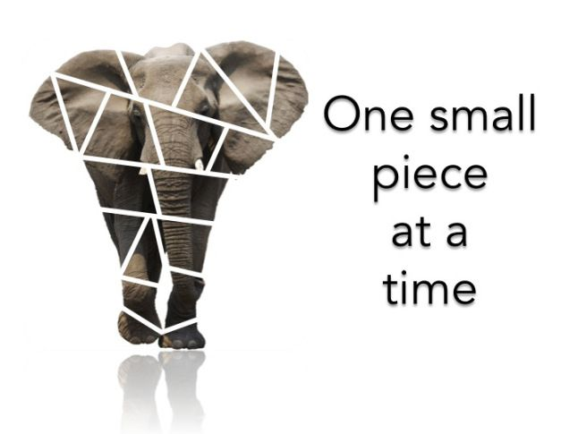

# 0. General tips for a successful completion

* **The project idea** | Generate a project idea that solves a data problem with practical values. Make sure the problem you try to solve is clearly defined. Make sure the scope of the problem is manageable so that you can complete it within the project timeframe. Meanwhile, think beyond the problem itself - can your solution to the problem inform how to solve other bigger/deeper problems? Another source: [**Developing strong research questions**](https://www.scribbr.com/research-process/research-questions/)

* **Home or away game?** | Related to the previous: Chosing a topic where you have background knowledge and/or a passion in can make make everything easier. On the other hand: Taking the harder route and chosing a topic where you have less domain knowledge can make quite an impression in the eyes of future employers who see that you're versatile when it comes to handling data.

* **Eat the elephant one piece at a time** | A lot of us do it intuitively, but it can be beneficial to recall it here:  A recommended way of thinking when it comes to tackle a complex problem like a *data analytics final project* is [First Principles](https://fs.blog/2018/04/first-principles/), briefly: Break the problem down to sub-problems. Look at the sub-problems, break them down, etc. This can be applied at any stage of your project, may it be the structuring of your workflow or on a very basic level, writing that for-loop that scrapes your tables on a website, where you would first make it work for one table. Once done, the step to making it work for all of them, is easy.

* **Obtain timely feedback** on your ideas, plans, progress, and products from the instructional staff. This ensures you stay on the right track and deliver impressive results.

* **MVP!** | Borrowed from agile project development: Set a relatively low bar for your first project iteration - in business language *MVP*, "**Minimum viable product**". Then try to reach that first iteration quickly. It doesn't have to look nice. But the idea is: You will now build on that and maybe answer an extended question in the remaining time. For example
  * 1st iteration: I have lot of animal sound data and I want to train an unsupervised model, which is able to (cluster) predict, whether that sound is a dog barking or not.
  * 2nd iteration: Building on that, I try to predict not only `Dog | No dog` but also multiple categories, e.g. `dog | cat | rattle snake | monkey | none of these`.
* Be prepared for technical difficulties. Manage your time wisely and pace yourself. Stick to the project agenda strictly.

* **Github**:
  * Commit your codes and push to Github on a regular basis.
  * You should commit every time you complete a task and push at least once a day.
  * Aim for meaningful commit messages so that later when you look at your commits they still make sense to you.
  All of this will help you avoid accidental data loss and is also the easiest way to document your iterative development process.

* **Regarding the presentation**
  * The target group for the final project presentations is **a general audience**, meaning not necessarily someone who is into Data Analytics. Think about your relatives or friends. Break down your content that you want to present in a way, that they will understand it, find it interesting and remember it. Since this is the audience, it can be beneficial to rehearse your talk in front of non-technical people (family, friends, etc.)
  * One exciting tool of audience engagement is always to include it (you can talk with class members before your talk... ahem) using a **demonstrator** of their machine learning project, with which students in the past made a real good impression on the general audience. Imagine people having no touching points with ML whatsover being asked live, what their age, body height, profession, hobbies etc. are (if they want to disclose that of course), and then based on these data your ML demonstrator recommends to them a piece of clothing (as a picture)/ a song/ a beer brand/ etc., which meets their approval, :mage: .
  * test every component and step of your demo. Make sure your demo will run smoothly.
  * make sure your can work with the **remote tools** (Zoom) to control your presentation (share screen (which?), eventually share sound, pointer, etc.). Feel free to use the zoom classroom to rehearse that in the week before the presentation
  * the day before all presentations start, we give you the opportunity for a final rehearsal in a breakout room in front of the teaching team. This is optional, but a lot of students made good experience with that in the past.


---

# 1. Datasources

You are free to use any data sources from Kaggle, UCI ML Repository, data.gov, public APIs, websites, etc. However, you will need to spend more time searching for and evaluating the quality and complexity of the data set you want to use. Discuss with your instructor as early as possible regarding your project ideas in order to avoid potential blockers.

In the following chapters you'll find various datasources. As examples, we explain some of them in the following and why they could be useful when used in your final project

## 1.1. Some datasets & their potential relevance for the final project

Find the links below this section!

#### Telecom Customer Churn 📱

This data set is great for practicing supervised machine learning. The most obvious supervised learning problem to model with this data set is attempting to predict churn (whether or not a customer is going to leave). Another supervised problem you can try to solve is predicting tenure, or how long a customer will end up staying with the company. There are also a lot of ways to slice, dice, and analyze this data set - for example, looking at how monthly charges increase or decrease depending on different types of contracts, tenure, and services provided.

#### Mental Health in Tech 🌀

This data set is also good for supervised learning, where you would attempt to predict whether the employee taking the survey has received treatment for mental health (treatment variable). You can also analyze how the other variables in the data set contribute to whether someone seeks treatment for mental health and explore what types of environments result in employees with the best mental health states.

#### Flight Delays and Cancellations ✈️

This relational data set can help you practice your SQL joins as well as supervised learning as you attempt to predict which flights will be delayed and by how much time. There are also a variety of ways to explore this data set to determine which airlines are most efficient, what times of the day there tend to be the most delays, which cities have more frequent delays than others, and how all this changes over time.

#### Craft Beers 🍺

This relational data set has fewer variables than the others, and that means that choosing it for your project will require you to apply some extra creativity. For example, you can create categorical variables out of the numeric abv and ibu variables to categorize a beer's strength and hoppiness. You can also use string operations on the style field to extract additional keyword-based categories (e.g. IPAs, American, English, Wheat, etc.). For modeling, you can attempt to predict the style of the beer or the probability that it falls into a particular style. Alternatively, you can attempt to compute the similarity between beers to determine which ones are most like with other ones.

#### Human Resources 👫👫👫

This is another relational data set where you can practice your SQL joins as well as data wrangling, analysis, and machine learning. As far as applying machine learning to this data set, you can attempt to cluster employees together into similar groups, you can attempt to predict performance scores or pay rate, or you can attempt to predict whether an employee will be terminated within a certain amount of time. Additionally, you can also analyze the relationship between pay and performance by position, department, and manager as well as employee demographics.

#### Syngenta Crop Analytics Challenge 🌽🌾

This is another data set where you can practice your SQL joins as well as data wrangling, analysis, and machine learning. The objective of this challenge is to use data analytics to provide answers to some of the questions that would help us support the growing food demands globally. We will use machine learning techniques to develop models to predict the performance of hybrid corn in different environments. In this project, use feature engineering on the environmental data provided and develop stress metrics such as heat stress, drought stress, a combination of heat and drought stress, and understand the individual contributions of each stress type on the yield. Then classify hybrid varieties of corn as either tolerant or susceptible based on the stress metric developed in the previous objective.

## 1.2. Dataset collection

### 1.2.1. Challenges & Competitions

  * [Syngenta Crop Analytics Challenge](https://www.ideaconnection.com/syngenta-crop-challenge/challenge.php)

### 1.2.2. Dataset aggregating websites

Name | description | link
--------------------------------|-------------|---------------------
Google dataset search           ||[link](https://datasetsearch.research.google.com/)
UCI Machine learning repository ||[link](https://archive.ics.uci.edu/ml/index.php)
Berlin open data repository  | Berlin specific Datasets (German knowledge helpful)  | https://daten.berlin.de/tags/open-data
London Data Store | London specific Datasets (ask Sian for explainers)  | https://data.london.gov.uk/
Data world | cloud catalog of many datasets (free, requires registration)  | https://data.world/
CRRC | datasets collected on the caucasus, useful non profit source of public opinions, impact etc - download as spss and convert in python  | https://caucasusbarometer.org/en/datasets/
NASA | what can i add except say its Nasa's data  | https://data.nasa.gov/browse

#### Kaggle sets

These are all Kaggle data sets, so you can gain some context about them by looking at the field descriptions and the `Overview` tab for each data set. You can also get project ideas by looking at the different `Kernels` that people have created using the data sets and the approaches they have taken, but please **do not** plagiarize or copy someone else's work. Remember that the goal of this project is to demonstrate *your* skills, not someone else's.

  * [Human Resources Dataset](https://www.kaggle.com/rhuebner/human-resources-data-set)
  * [Craft Beers Dataset](https://www.kaggle.com/nickhould/craft-cans)
  * [Flight Delays and Cancellation Dataset](https://www.kaggle.com/usdot/flight-delays)
  * [Mental Health in Tech Survey Data](https://www.kaggle.com/osmi/mental-health-in-tech-survey)
  * [Telecom Customer Churn Dataset](https://www.kaggle.com/blastchar/telco-customer-churn)

#### Loose links

* [24 Ultimate Data Science (Machine Learning) Projects To Boost Your Knowledge and Skills (& can be accessed freely)](https://www.analyticsvidhya.com/blog/2018/05/24-ultimate-data-science-projects-to-boost-your-knowledge-and-skills/)


## 1.2.3. API-Sources

* ["AnyAPI"](https://any-api.com/)
* [List of python API wrappers](https://github.com/realpython/list-of-python-api-wrappers)
* googling `python <sitename> api`
* rapidAPI - as used in module 7

---

# 2. Data Visualization

* [Python graph gallery](https://python-graph-gallery.com/all-charts/). A vast collection of matplotlib based (seaborn, matplotlib, pandas, etc.) plots with their respective code snippets. If you need a plot, pick one, check the code, copy-paste it and change it according to your needs
* [80 Data Visualization examples using location data and maps](https://carto.com/blog/eighty-data-visualizations-examples-using-location-data-maps/)
* [From Data to Viz - The ultimate guide to plotting](https://www.data-to-viz.com/), click the plot symbols to get Python code snippets shown
* [Makeover Monday] (https://www.makeovermonday.co.uk/) , look at weekly project topics, access data sources and see how others visualised it 
* [information is beautiful] (https://informationisbeautiful.net/) , what can we add to the title ? 
* [storytelling with data] (https://www.storytellingwithdata.com/blog), the SWD challenge blog - highly recommended 

# 3. Presentations

* [Presenting code in Jupyter notebook](https://medium.com/@mjspeck/presenting-code-using-jupyter-notebook-slides-a8a3c3b59d67) (helpful if you want to live demonstrate your model inference/predictions e.g.)

* Don't spend too much time on crafting a coherent style of your presentation. Remember you can still make use of existing style templates, e.g. from [here](https://slidesmania.com/free-templates/) (pay attention to mention the author though if necessary)

# 4. General Python hints

* A lot of times you will face the situation of having to perform a job on a "huge thing" that can be separated into individual pieces, such as:
  * data cleaning for multiple columns in a dataframe,
  * data cleaning for a column that contains multiple entries
  * scrape multiple websites
  * on a website, scrape a table and extract only one entry of a row
  * etc.

* If you encounter a problem in that needs to be solved and you assume that this might be a common problem ("I need all the states of the Asian and European continent in a list!"), the likelihood is high that someone has already wrote a python package that you can make use. This can save you a lot of time compared to write yourself your own function / manually solve the problem. Have here a [curated list of python tools](https://github.com/vinta/awesome-python)

* A general approach of problem solving here can be borrowed from *first principles thinking* (see above!): **First make it work for one case**. Before of course, find out the structure/the patterns/the similarities of that single case within the context of the all cases, **then scale up and apply it to all cases** (meaning for example: Write a `for`-loop that does the job)

  Some examples:
  * **data cleaning**:
    define a function first, which does the job for one specific value `x` in your columns, then use it in die `.apply()` function of a dataframe

    ```python
    def my_cleaning_function(x):
        return x.lstrip('_D4hj2', '').rstrip('MON_', '')

    df['column_to_clean'] =  df['column_to_clean'].apply(my_cleaning_function)
    ```

  * **webscraping**:
    You want to scrape search results on *imdb* which are presented in multiple pages that you have to click through. Approach: You would want to write the code which scrapes one single page first, maybe even put it into a function. Then find out the pattern of the URL, which all result pages have in common, and then alter your function in a way, that you can input any (search result) url in it. And ultimately construct a loop in which you would generate your desired URL's, throw these into your function which gets executed in every loop, e.g.

    ```python
    iterations = range(1, 631, 50)
    for i in iterations:
    # assemble the url:
      start_at= str(i)
      url = "https://www.imdb.com/search/title/?title_type=feature&release_date=1990-01-01,1992-12-31&user_rating=7.5,&start=" + start_at + "&ref_=adv_nxt"

      # download html with a get request:
      response = requests.get(url)

      # in the following: store that into a soup
    ```
* It may happen that you ask yourself: Is it possible to define variables dynamically? As in, "I have here COVID data for 120 countries, and I want to create one dataframe for each country. Can this be achieved in Python?. The short answer is: Don't. There are always better ways to achieve this, see this [stackoverflow link](https://stackoverflow.com/questions/5036700/how-can-you-dynamically-create-variables-via-a-while-loop)

## Further material
* *Python tricks* - Dan Bader,  ASIN : B0785Q7GSY

---


# 5. Other

#### stress & workload & focus management

* [tomato timer! ](https://tomato-timer.com/)
